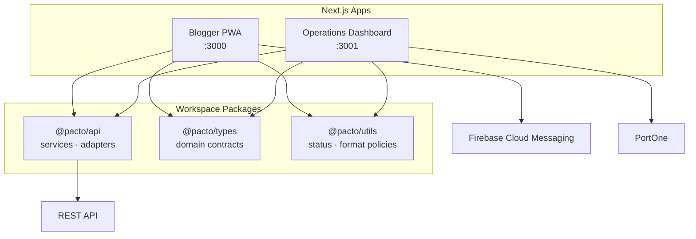

# Pacto

> 블로그 마케팅 캠페인의 모집부터 콘텐츠 검수, 에스크로 정산까지 하나의 흐름으로 연결한 B2B2C 플랫폼

Pacto는 광고주·광고 대행사·블로거 사이에 흩어진 캠페인 운영 과정을 제품 안에서 추적 가능하게 만듭니다. 블로거에게는 모바일 중심의 참여 경험을, 운영자에게는 대량 업무를 빠르게 처리하는 대시보드를 제공합니다.

이 저장소는 두 개의 Next.js 앱과 공통 도메인 패키지를 pnpm workspace로 관리하는 프론트엔드 모노레포입니다.

## 해결하려는 문제

기존 블로그 마케팅 운영은 모집, 지원자 선정, 콘텐츠 확인, 정산이 서로 다른 채널에서 진행되어 상태와 책임을 추적하기 어렵습니다.

Pacto는 다음 흐름을 하나의 상태 기반 프로세스로 연결합니다.


## 사용자별 경험

| 사용자      | 제품           | 주요 기능                                                    |
| ----------- | -------------- | ------------------------------------------------------------ |
| 블로거      | 모바일 웹/PWA  | 캠페인 탐색·지원, 미션 제출, 알림, 포인트·출금 관리          |
| 광고 대행사 | 운영 대시보드  | 캠페인 생성, 지원자 일괄 심사, 미션 검수, 에스크로·정산 조회 |
| 광고주      | 제한형 웹 화면 | 캠페인별 예산 결제와 결과 리포트 확인                        |

광고주용 기능을 별도 앱으로 확장하지 않고 결제·리포트 화면에 집중해, 핵심 거래 흐름을 우선 완성했습니다.

## 구현에서 집중한 부분

### 1. 역할별 UX를 분리한 모노레포

- `blogger`: 작은 화면과 반복 방문을 고려한 모바일 웹/PWA
- `dashboard`: 정보 밀도와 운영 효율을 우선한 B2B 대시보드
- API, 타입, 금액·날짜 포맷, 상태 정책은 workspace 패키지로 공유

### 2. 백엔드 변화에 견디는 API 계층

화면에서 서버 응답을 직접 사용하지 않고 `service → adapter → domain type` 경계를 두었습니다. 공통 응답 래퍼와 일부 형태가 다른 응답을 API 패키지에서 정규화해 화면의 변경 범위를 줄였습니다.

### 3. 끊기지 않는 인증 세션

앱이 소유한 HttpOnly 쿠키에 세션을 보관하고, Next.js proxy에서 만료 임박 토큰을 감지해 refresh token을 회전합니다. 새 access token은 현재 요청에도 주입해 사용자가 작업 도중 갑자기 로그아웃되는 문제를 줄였습니다.

### 4. 도메인 상태를 코드와 테스트로 관리

캠페인·지원서·미션·에스크로 상태를 UI 곳곳의 조건문으로 흩뜨리지 않고 공통 정책 함수로 관리합니다. 상태 표시, 행동 가능 여부, 정산 금액 포맷, 캠페인 탐색 규칙을 7개 테스트 파일로 검증합니다.

### 5. 모바일 성능과 설치 경험

- 핵심 로컬 이미지 6개의 합계를 2.80MB에서 181KB로 줄여 약 93.5% 절감
- 중복 인증 API 요청을 React request cache로 통합
- 외부 폰트 CSS 의존성을 제거해 초기 렌더링 경로 단축
- Web App Manifest와 Firebase Cloud Messaging 기반 알림 경험 구현

측정 조건과 개선 내역은 [성능 문서](./docs/performance/blogger-performance-improvement-2026-07-13.md)에 기록했습니다.

## 아키텍처



## 기술 스택

| 영역      | 기술                                                     |
| --------- | -------------------------------------------------------- |
| Framework | Next.js 16 App Router, React 19                          |
| Language  | TypeScript                                               |
| Workspace | pnpm workspace                                           |
| Data      | Server Components, Server Actions, TanStack Query        |
| API       | typed service, adapter, 공통 오류 처리                   |
| Styling   | CSS, 반응형 모바일·데스크톱 레이아웃                     |
| Editor    | MDXEditor, Tiptap JSON 호환 가이드 데이터                |
| PWA/Push  | Web App Manifest, Firebase Cloud Messaging               |
| Payment   | PortOne                                                  |
| Quality   | Vitest, ESLint, Prettier, Husky, lint-staged, commitlint |

## 저장소 구조

```text
apps/
├─ blogger/       블로거 모바일 웹/PWA
└─ dashboard/     대행사 대시보드와 광고주 제한 화면
packages/
├─ api/           API 서비스, 응답 adapter, 공통 오류 처리
├─ types/         캠페인·지원·미션·정산 도메인 타입
└─ utils/         상태 정책, 검색 규칙, 금액·날짜 포맷
docs/             제품 결정, UI 정책, 성능 측정 기록
```

## 로컬 실행

### 요구 사항

- Node.js 현재 LTS
- Corepack 또는 pnpm 9
- 실행 가능한 Pacto REST API

### 설치

```bash
corepack enable
pnpm install
```

앱별 예시 파일을 복사한 뒤 필요한 키를 입력합니다.

```powershell
Copy-Item apps/blogger/.env.example apps/blogger/.env.local
Copy-Item apps/dashboard/.env.example apps/dashboard/.env.local
```

두 앱을 동시에 실행합니다.

```bash
pnpm dev
```

- Blogger: `http://localhost:3000`
- Dashboard: `http://localhost:3001`

Firebase 값은 푸시 알림에, PortOne 값은 결제 기능에 필요합니다. 나머지 기능을 먼저 확인할 때는 API 주소만 설정할 수 있습니다.

## 품질 확인

```bash
pnpm typecheck       # 전체 workspace 타입 검사
pnpm test            # 도메인 정책과 API adapter 테스트
pnpm lint            # 정적 분석
pnpm format:check    # 문서와 코드 포맷 확인
pnpm build           # 두 Next.js 앱 프로덕션 빌드
```

## 문서

문서는 [Documentation Index](./docs/README.md)에서 목적별로 확인할 수 있습니다. 현재 동작은 코드와 이 README를 기준으로 하며, 세부 문서는 의사결정의 배경과 정책을 설명합니다.

## 프로젝트 범위

Pacto는 핵심 캠페인 거래가 처음부터 끝까지 이어지는 MVP입니다. 광고주용 전체 운영 제품, 고급 분석, 백오피스 자동화는 현재 범위에 포함하지 않았습니다. 제한된 기간 안에서 역할별 핵심 문제와 거래 안정성을 우선한 제품 설계입니다.
