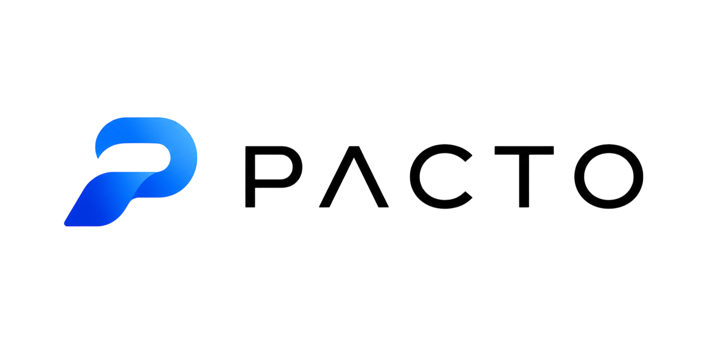
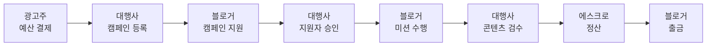
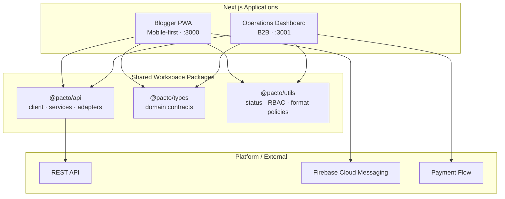
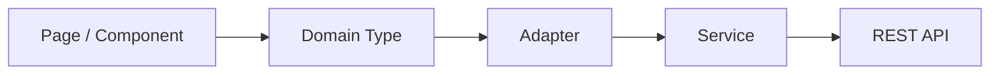
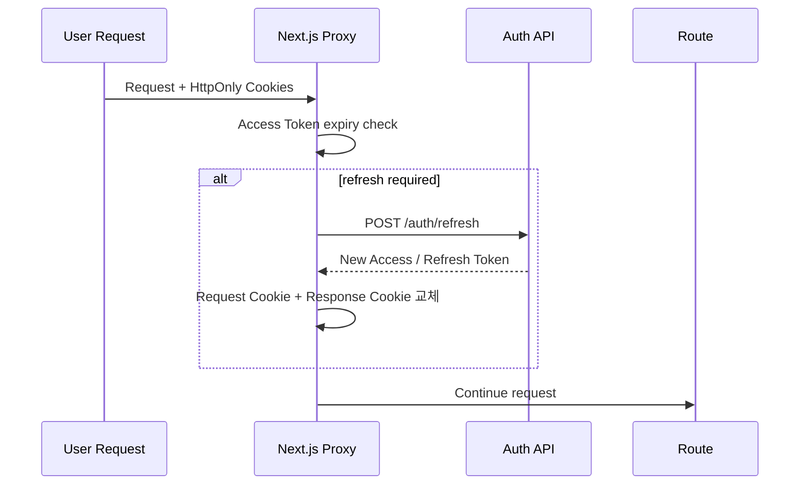
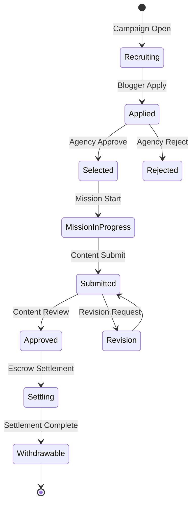

<div align="center">



# Pacto

### 블로그 마케팅 캠페인의 모집부터 콘텐츠 검수, 에스크로 정산까지 하나의 흐름으로 연결한 B2B2C 플랫폼

**Blogger Mobile Web / PWA · Operations Dashboard · Shared Domain Packages**


<br />

`8주 MVP` · `프론트엔드 개발 1인` · `2개의 역할별 Next.js App` · `pnpm Workspace`

</div>

---

## Overview

**Pacto**는 광고주·광고 대행사·블로거 사이에 흩어진 캠페인 운영 과정을 하나의 제품 안에서 추적 가능하게 만드는 플랫폼입니다.

기존 블로그 마케팅은 모집, 지원자 선정, 콘텐츠 확인, 비용 정산이 서로 다른 채널에서 진행되는 경우가 많아 **현재 상태와 다음 행동, 책임 주체를 파악하기 어렵다**는 문제가 있었습니다.

Pacto는 이를 **상태 기반의 하나의 거래 흐름**으로 연결합니다.



이 저장소는 **두 개의 Next.js 앱과 공통 도메인 패키지를 pnpm workspace로 관리하는 프론트엔드 모노레포**입니다.

---

## At a Glance

| | |
| --- | --- |
| **Frontend Scope** | 8주 MVP · 프론트엔드 개발자 1명 |
| **Blogger Experience** | 모바일 중심 웹/PWA · 캠페인 탐색·지원·미션·지갑·알림 |
| **Operations Experience** | 캠페인 생성·지원자 심사·콘텐츠 검수·에스크로·리포트 대시보드 |
| **Architecture** | Next.js App Router · pnpm workspace · shared API/types/utils |
| **Data Boundary** | service → adapter → domain type |
| **Session** | HttpOnly Cookie · Proxy 기반 Access Token Refresh |
| **Performance** | 핵심 이미지 자산 2.80MB → 181KB, 약 **93.5% 감소** |
| **Quality** | TypeScript · Vitest · ESLint · Prettier · Husky · lint-staged · commitlint |

---

## Product Experience

Pacto는 같은 도메인을 사용하지만 목적이 전혀 다른 사용자 경험을 하나의 UI로 억지로 합치지 않았습니다.

### 📱 Blogger Mobile Web / PWA

블로거는 짧은 시간 안에 캠페인을 발견하고 지원하며, 진행 중인 미션과 정산 상태를 반복적으로 확인합니다.

그래서 Blogger 앱은 **작은 화면, 빠른 탐색, 반복 방문**에 맞춰 설계했습니다.

- 캠페인 탐색 및 상세 조회
- 캠페인 지원
- 지원/선정 상태 확인
- 미션 수행 및 콘텐츠 제출
- 알림
- 포인트 및 출금 관리
- Web App Manifest 기반 설치 경험
- Firebase Cloud Messaging 기반 알림

### 🖥️ Operations Dashboard

대행사 운영자는 동시에 많은 캠페인과 지원자를 처리해야 합니다.

Dashboard는 모바일 앱과 반대로 **정보 밀도와 일괄 처리 효율**을 우선했습니다.

- 캠페인 생성 및 관리
- 지원자 조회 및 심사
- 미션/콘텐츠 검수
- 에스크로 및 정산 상태 조회
- 가이드 콘텐츠 작성
- 광고주 결제/리포트 제한 View
- RBAC 기반 역할별 접근 제어

### 💳 Advertiser Experience

8주 MVP에서 광고주를 위한 별도 세 번째 앱을 만들지 않았습니다.

광고주는 초기 제품에서 직접 캠페인을 운영하기보다 **결제와 결과 확인에 집중한다**고 판단해 Dashboard 내부의 제한된 View로 구성했습니다.

이 선택으로 세 개의 UX를 두 개의 앱으로 압축하고, 모집 → 수행 → 검수 → 정산으로 이어지는 핵심 거래 흐름을 먼저 완성했습니다.

---

## Frontend Architecture



### Workspace Structure

```text
Pacto-frontend-v2/
├── apps/
│   ├── blogger/               # 블로거 모바일 웹 / PWA
│   └── dashboard/             # 대행사 운영 Dashboard + 광고주 제한 View
│
├── packages/
│   ├── api/                   # API client · services · response adapters
│   ├── types/                 # 캠페인 · 지원 · 미션 · 정산 도메인 타입
│   ├── utils/                 # status · RBAC · campaign · format policy
│   └── ui/                    # 공통 UI package scaffold
│
├── docs/                      # 설계 결정 · API 정책 · 성능 측정 기록
├── package.json
└── pnpm-workspace.yaml
```

---

## Engineering Decisions

### 1. 역할별 UX를 분리하되 도메인은 공유

블로거용 모바일 경험과 대행사용 운영 도구는 정보 구조가 크게 다릅니다.

하나의 Next.js 앱 안에서 모든 역할을 조건문으로 분기하는 대신 `apps/blogger`, `apps/dashboard`로 런타임을 분리했습니다. 반면 API contract, 상태 정책, 포맷 로직은 workspace package에서 공유합니다.

```text
User Experience             Shared Domain
──────────────────          ──────────────────
Blogger Mobile App   ─┐     @pacto/api
                      ├──→  @pacto/types
Operations Dashboard ─┘     @pacto/utils
```

이를 통해 **사용자별 UX는 독립적으로 설계하면서도 도메인 규칙의 중복은 줄이는 구조**를 만들었습니다.

### 2. Backend Response와 UI 사이에 Adapter Layer 배치

MVP 개발 당시 일부 백엔드 API 응답 계약이 계속 구체화되는 상황을 고려했습니다.

화면 컴포넌트에서 API 원본 응답을 직접 사용하지 않고 다음 경계를 두었습니다.



- `service`: API 호출 책임
- `adapter`: 서버 응답을 프론트 도메인 형태로 정규화
- `domain type`: 화면이 의존하는 안정적인 계약

백엔드 응답 형태가 변해도 **화면 전체가 아니라 adapter를 중심으로 변경 범위를 제한**하는 것이 목적입니다.

### 3. 인증 갱신을 화면 로직에서 분리

Access Token과 Refresh Token은 앱이 소유하는 **HttpOnly Cookie**에 저장합니다.

Next.js `proxy.ts`에서 Access Token 만료가 임박했는지 확인하고, 필요한 경우 refresh API를 호출해 토큰을 회전합니다.



새 Access Token을 **응답 Cookie뿐 아니라 현재 요청 Header에도 함께 주입**해, 토큰을 갱신한 바로 그 요청에서도 기존 세션이 끊기지 않도록 처리했습니다.

### 4. 상태를 UI 조건문이 아니라 Domain Policy로 관리

Pacto에서는 캠페인·지원서·미션·정산 상태가 곧 사용자의 행동 가능 여부를 결정합니다.

이 규칙을 페이지 곳곳의 `if`문으로 분산시키지 않고 `@pacto/utils`에서 관리합니다.

```text
packages/utils/src/
├── campaign/       캠페인 탐색·상태 규칙
├── status/         상태 표시 및 행동 정책
├── rbac/           역할별 접근 정책
└── format/         금액·날짜 등 표현 규칙
```

이 방식으로 **상태 표시와 실제 행동 가능 조건이 서로 어긋나는 문제를 줄이고**, 테스트 가능한 순수 함수 형태로 도메인 규칙을 분리했습니다.

### 5. 서버 상태와 렌더링 특성에 맞춰 Data Fetching 선택

두 앱은 모든 데이터를 한 방식으로 가져오지 않습니다.

- Next.js Server Components / Server Actions를 활용해 서버에서 처리하기 좋은 흐름은 서버 중심으로 구성
- Blogger의 상호작용이 많은 클라이언트 상태에는 TanStack Query를 사용할 수 있는 구조 구성
- 동일한 서버 렌더 요청 안에서 반복되는 인증 데이터는 React request cache로 중복 호출 제거

도구 자체보다 **데이터의 수명과 사용자 상호작용 특성에 맞는 위치에서 상태를 소유하는 것**에 초점을 맞췄습니다.

---

## Performance Optimization

Blogger 앱은 Lighthouse 기준선에서 Dashboard보다 모바일 성능 개선 필요성이 크게 나타났습니다.

그래서 화면을 무작정 리팩토링하기보다 **전송량 → 렌더 블로킹 → 중복 서버 요청 → 초기 데이터량** 순서로 병목을 줄였습니다.

### 이미지 전송량 개선

| Asset Group | Before | After | Reduction |
| --- | ---: | ---: | ---: |
| 주요 캠페인/일러스트 6개 | 2.80 MB | 181 KB | **93.5% ↓** |

약 **2.62MB의 로컬 이미지 payload**를 줄였습니다.

주요 작업:

- 대형 PNG → WebP 변환
- 렌더 블로킹 외부 폰트 CSS 제거
- React request cache를 이용한 인증 데이터 fetch 중복 제거
- 캠페인 초기 요청량 `100 → 24` 축소
- Above-the-fold 카드 이미지 우선 로딩
- 나머지 이미지는 lazy loading 유지

성능 개선 과정은 결과 숫자만 남기지 않고 기준선과 판단 근거를 문서화했습니다.

→ [`Blogger Performance Improvement Report`](./docs/performance/blogger-performance-improvement-2026-07-13.md)

---

## Tech Stack

### Core

| Category | Technology |
| --- | --- |
| Framework | Next.js 16 App Router |
| UI Runtime | React 19 |
| Language | TypeScript |
| Monorepo | pnpm workspace |
| Server State | TanStack Query v5, Server Components, Server Actions |
| Icons | Lucide React |

### Product Integration

| Category | Technology / Approach |
| --- | --- |
| PWA | Web App Manifest |
| Push | Firebase Cloud Messaging |
| Rich Editor | MDXEditor · Tiptap-compatible guide data |
| Auth | HttpOnly Cookie · Proxy Refresh |
| API | typed service · adapter · common error handling |
| Access Control | RBAC policy |

### Quality

| Category | Technology |
| --- | --- |
| Test | Vitest · MSW |
| Static Analysis | ESLint |
| Formatting | Prettier |
| Git Hooks | Husky · lint-staged |
| Commit Convention | commitlint |
| Type Safety | workspace-wide TypeScript typecheck |

---

## Domain Flow

Pacto에서 중요한 것은 개별 페이지가 아니라 **상태가 다음 행동을 결정하는 전체 흐름**입니다.



캠페인 상태와 미션/정산 상태는 사용자 역할에 따라 서로 다른 CTA와 정보 표현으로 연결됩니다.

---

## Repository Structure

```text
apps/
├── blogger/
│   ├── app/                   # App Router pages / layouts
│   ├── public/                # manifest · images · PWA assets
│   └── proxy.ts               # token refresh / request session handling
│
└── dashboard/
    └── app/                   # Operations / advertiser views

packages/
├── api/
│   └── src/
│       ├── client/
│       ├── services/
│       └── adapters/
├── types/
├── utils/
│   └── src/
│       ├── campaign/
│       ├── format/
│       ├── rbac/
│       └── status/
└── ui/

docs/
├── decision-log.md
├── design-direction-rationale.md
├── common-mobile-design-system.md
├── ui-ux/
└── performance/
```

---

## Getting Started

### Requirements

- Node.js current LTS
- Corepack 또는 pnpm 9
- 실행 가능한 Pacto REST API

### Install

```bash
git clone https://github.com/Dev-SangWoo/Pacto-frontend-v2.git
cd Pacto-frontend-v2

corepack enable
pnpm install
```

### Environment

앱별 예시 환경변수를 복사합니다.

```bash
cp apps/blogger/.env.example apps/blogger/.env.local
cp apps/dashboard/.env.example apps/dashboard/.env.local
```

Windows PowerShell:

```powershell
Copy-Item apps/blogger/.env.example apps/blogger/.env.local
Copy-Item apps/dashboard/.env.example apps/dashboard/.env.local
```

### Development

두 앱을 동시에 실행:

```bash
pnpm dev
```

앱별 실행:

```bash
pnpm dev:blogger
pnpm dev:dashboard
```

| App | Local URL |
| --- | --- |
| Blogger | `http://localhost:3000` |
| Dashboard | `http://localhost:3001` |

---

## Quality Checks

```bash
pnpm typecheck       # workspace 전체 타입 검사
pnpm test            # domain / API adapter 테스트
pnpm test:coverage   # coverage 포함 테스트
pnpm lint            # ESLint
pnpm format:check    # Prettier 검사
pnpm build           # 두 Next.js 앱 production build
```

커밋 전에는 Husky와 lint-staged를 통해 변경 파일의 정적 분석과 포맷을 확인합니다.

---

## Documentation

구현 결과뿐 아니라 **왜 그런 구조를 선택했는지**를 남기는 것을 중요하게 생각했습니다.

| Document | Description |
| --- | --- |
| [`Decision Log`](./docs/decision-log.md) | 앱 분리, MVP 범위, API 전략 등 주요 결정 |
| [`API Strategy`](./docs/ui-ux/api-strategy.md) | REST API 경계와 adapter 전략 |
| [`RBAC Policy`](./docs/ui-ux/rbac-policy.md) | 역할별 접근 권한과 라우팅 |
| [`Status Policy`](./docs/ui-ux/status-policy.md) | 캠페인·미션·정산 상태 정책 |
| [`Mobile Design System`](./docs/common-mobile-design-system.md) | Blogger 모바일 UI 규칙 |
| [`Performance Report`](./docs/performance/blogger-performance-improvement-2026-07-13.md) | Lighthouse 기반 성능 분석 및 개선 |

전체 문서는 [`docs/README.md`](./docs/README.md)에서 확인할 수 있습니다.

---

## Project Scope

Pacto는 **모집 → 선정 → 콘텐츠 수행 → 검수 → 에스크로 정산**이라는 핵심 거래 흐름을 완성하는 데 집중한 MVP입니다.

8주라는 제한된 기간과 1인의 프론트엔드 개발 리소스 안에서 광고주용 전체 self-service 제품을 별도로 만드는 대신, 블로거와 운영자의 핵심 문제를 우선 해결했습니다.

고급 분석, 광고주용 전체 운영 제품, 백오피스 자동화는 MVP 이후의 확장 영역으로 남겨 두었습니다.

---

<div align="center">

**Pacto Frontend** — 하나의 도메인을 서로 다른 사용자 경험으로 설계하고, 공통 규칙은 코드로 공유합니다.

</div>
